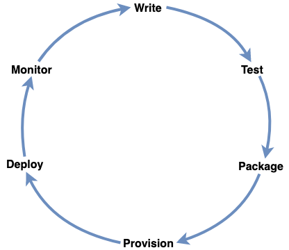

# Software Development Platform

Welcome to the Workiva Software Development Platform!

We provide the tools to help you write, test, package, provision, deploy and monitor software at Workiva.

As with any Software Development Platform, not all things can be in one location or managed together in a single repo.
As such, this repo serves as a "jumping off point" for engineers at Workiva looking to build their software with the highest quality standards.
Below, is a list of various components necessary to build software at Workiva.

* Write
  * Language SDKs
    * [Go](platform.go) (TODO: link to the developer docs)
    * Java (TODO)
    * Dart (TODO)
    * Python (TODO)
  * Security Guidelines
  * StyleGuides
* Test
  * Test Eng Stuff
  * Skynet Stuff
  * Signals Stuff
* Package
  * [Packager](package)
  * [Aviary](https://dev.workiva.net/docs/teams/information-security/aviary)
* Provision
  * CloudFormation Stuff
  * MARV Stuff
* Deploy
  * Release Pipelines
* Monitor
  * New Relic

<!-- ## [Start Here](https://dev.webfilings.org/)

Platform
================

Services
------------
[Linking](https://github.com/workiva/linking)

[Identity](https://github.com/Workiva/Identity)

[Permissions](https://github.com/Workiva/OmniCorp/)

[Audit](https://github.com/Workiva/OmniCorp/)

[Config](https://github.com/Workiva/OmniCorp/)

[Email](https://github.com/Workiva/OmniCorp/)

[Server Scaling](https://github.com/Workiva/bolt)

Application Platforms and Frameworks
-------------
[H5 Application Platform](https://github.com/workiva/H5ClientPlatform)

[UI Platform](https://github.com/Workiva/w-ui-platform)

Business Platforms
---------------------
[Rich Content Platform](https://github.com/workiva/content)

Platform Specs
---
[platform-specs](https://drive.google.com/drive/folders/0B5BHXAruc8vBNDJlX29XajEwNGc) folder

[Application Logging Spec](https://github.com/Workiva/platform/blob/master/specs/app/logging/1.0.0/spec.md)

[Application Telemetry Spec](https://github.com/Workiva/platform/blob/master/specs/app/telemetry/0.0.1/spec.md)

[Gen2 Telemetry Specification](https://drive.google.com/open?id=1g0QUF0kRRKRzODOP0-W2feL_6QjQxSLl-r5cnZXaUTc)

[Harbour Logging](https://docs.google.com/a/webfilings.com/document/d/1TbPq5Erb1J26BltBNBlpUj53Zt4Lr_ZyJGaMxjmL9UI/edit?usp=sharing)

[Vessel Pub/Sub Channel Spec](https://docs.google.com/a/webfilings.com/document/d/1YyI14WkxdBvuQPx1_rHco7rSb_Qs7rzAuHiVGM2jmmU/edit?usp=sharing)

Teams:
=================

[OmniCorp](https://github.com/Workiva/OmniCorp/)

[Messaging](https://github.com/Workiva/messaging) -->
